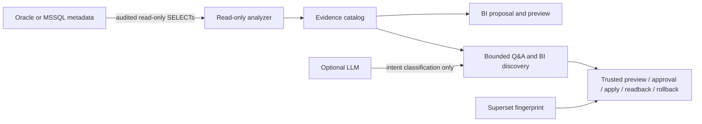

# KaleidoSphere

<picture>
  <source srcset="services/bi-agent/assets/kaleidosphere-logo.svg" type="image/svg+xml">
  
</picture>

[](https://github.com/JoFe2/KaleidoSphere/actions/workflows/ci.yml)
[](https://github.com/JoFe2/KaleidoSphere/releases/latest)
[](LICENSE)
[](compose.yaml)

**KaleidoSphere — Multi-perspective Business & Decision Intelligence**

KaleidoSphere is the PANSPHAIRA ecosystem system for Business Intelligence,
analytics, and Decision Intelligence. KaleidoSphere transforms fragmented
enterprise data into coherent perspectives, revealing patterns, dependencies
and actionable insights.

Understand your database. Define the right dashboards. Keep SQL, credentials
and persistent authority out of clients and models.

KaleidoSphere is a local first-pass database understanding and BI
requirements workflow for BI, data, and platform teams. It analyzes Oracle or
Microsoft SQL Server metadata with a read-only account, stores an
evidence-bound technical catalog, guides dashboard requirement discovery, and
prepares review-bound technical overview workflows for its own Apache Superset
stack. Optional model use is limited to bounded intent classification.

## Release identity

KaleidoSphere uses separate, intentionally pinned version axes:

| Layer | Version | Meaning |
|---|---:|---|
| Repository release | `v0.25.0` | Current source and release-archive identity |
| bi-agent component | `v0.18.1` | Runtime product identity attested by the embedded service |
| External API contract | `2.0.0` | Closed six-action wire contract |
| Apache Superset | `6.1.0` | Digest-pinned local projection UI |

The component and API versions do not imply that the repository is still on an
older release.

## What you can do

- Analyze Oracle or Microsoft SQL Server metadata with audited read-only query packs.
- Build a versioned local catalog with receipt IDs, snapshot hashes, coverage states, and blind spots.
- Ask bounded technical questions about size, statistics, dependencies, stored logic, and coverage.
- Run guided BI requirements discovery and export a human/machine brief with catalog provenance.
- Preview fixed managed Superset overview dashboards for system, table, code, and coverage views.
- Collect a read-only Superset runtime fingerprint before future reviewed promotion planning.
- Build, inspect, and fail-closed preflight a deterministic review-only promotion ZIP from confirmed evidence.
- Validate promotion execution as **library/test evidence only** against an
  isolated synthetic owned metadata target; no shipped CLI, HTTP, or operator
  invocation path is claimed.

## Try it in 5 minutes

The default quickstart uses a deterministic synthetic fixture. It does not need
an external database or an API key.

Requirements: Docker Engine with Compose v2, OpenSSL, and free localhost ports
`18088` and `18790`.

```bash
git clone https://github.com/JoFe2/KaleidoSphere.git
cd KaleidoSphere
cp .env.example .env
./bin/bi setup
./bin/bi up
./bin/bi status
./bin/bi analyze
./bin/bi ask "Largest tables by size"
./bin/bi discovery start demo
./bin/bi discovery answer demo audienceRole "Sales analyst"
./bin/bi discovery answer demo businessQuestions '["Which order value should be watched weekly?"]'
./bin/bi discovery status demo
./bin/bi superset-fingerprint collect
./bin/bi down
```

Open <http://127.0.0.1:18790> for KaleidoSphere and
<http://127.0.0.1:18088> for Superset. The generated Superset `analyst`
password is stored in `.runtime/secrets/superset_analyst_password` with mode
`0600` and is not printed by the scripts.

## AgentSkills package

`agent-skills/kaleidosphere` is one shared, instruction-only AgentSkill for the
six closed External API v2 intents. It adds no endpoint, credential, provider,
plugin executable or mutation authority.

Codex and Claude Code can install the same package with the current
AgentSkills installer:

```bash
npx skills add ./agent-skills/kaleidosphere \
  --agent codex claude-code --skill kaleidosphere --copy -y
```

OpenClaw uses the same package under `<workspace>/skills/kaleidosphere`;
Hermes uses `~/.hermes/skills/kaleidosphere`. Host-specific installation and
evidence status are recorded in `agent-skills/host-contracts.json`. No
marketplace listing is claimed.

## DSH and host integrations

The AgentSkill above is instruction-only. The optional
[`JoFe2/kaleidosphere-dsh-plugin`](https://github.com/JoFe2/kaleidosphere-dsh-plugin)
is a separate **Developer Preview** for DeepSeek Harness rc.8. It is not part
of the KaleidoSphere v0.25.0 release assets and adds no DSH dependency, loader
or mapping to this repository. The plugin exposes six native
`kaleidosphere_*` tools and vendors its own exact KaleidoSphere v0.16.0 subset;
its compatibility, lifecycle and release status are governed in that repository.

## First result

The fixture run returns real local evidence over synthetic metadata, not
production evidence. A successful response includes:

```json
{
  "intent": "ANALYZE",
  "tools": ["status", "analyze", "catalog_ingest", "readback", "catalog_question"],
  "analysisReceipt": {
    "receiptId": "mssql-...",
    "runtimeValidation": "SYNTHETIC_UNVALIDATED",
    "snapshotSha256": "..."
  },
  "publication": {"status": "AWAITING_TRUSTED_APPROVAL", "mutationPerformed": false}
}
```

Local catalog answers include receipt, snapshot, scope, and coverage caveats.

## Workflow



KaleidoSphere does not send free-form SQL to a source database, does not
sample source rows, and does not give Superset direct source-database
credentials.

## Why teams use it

Direct LLM-to-SQL workflows can blur exploration, credential-bearing access, and
production data exposure. KaleidoSphere narrows the surface: collect safe
metadata, preserve coverage evidence, ask deterministic catalog-bound questions,
turn requirements into a reviewable brief, and show fixed technical dashboards
backed by the local catalog.

## Security by design

- Source adapters use read-only metadata queries and fail closed on unsafe
  rights or scope mismatch.
- Source rows, raw SQL prompts, credentials, raw PL/SQL/view text, DB-link secrets, and provider keys are excluded from model input.
- Superset connects only to the local projection database; it does not receive
  Oracle or MSSQL credentials.
- The default agent path runs offline with `LLM_MODE=stub`.
- Optional OpenAI-compatible providers may classify only `ANALYZE`, `STATUS`, or `DENY`.
- Containers are unprivileged, capability-dropped, and expose only localhost UI ports.
- Destructive reset requires `./bin/bi reset --yes-i-understand`.

See [docs/SECURITY.md](docs/SECURITY.md) for the full trust boundary.

## Live database configuration

The fixture mode in `.env.example` is the portable default. To analyze a live
database, choose exactly one engine:

- `BI_ENGINE=mssql` for Microsoft SQL Server metadata analysis.
- `BI_ENGINE=oracle` for Oracle metadata analysis through `node-oracledb` Thin
  mode.

Put source passwords only in `.secrets/mssql_password` or `.secrets/oracle_password`,
keep the files mode `0600`, and grant the analyzer principal only the minimum
read visibility for the declared schemas. Details are in
[docs/CONFIGURATION.md](docs/CONFIGURATION.md).

## Current capabilities and boundaries

### Default runtime and documented CLI

- Oracle and Microsoft SQL Server read-only metadata analysis.
- Versioned evidence-bound local technical catalog and bounded technical Q&A.
- Guided BI requirements discovery with Markdown/JSON brief export.
- Review-bound managed technical overview dashboard workflows in Apache Superset.
- Server-attested External API `2.0.0` with six closed External API v2 actions:
  status, discovery, analyze, plan, preview and readback. The runtime reports
  `bi-agent` product `v0.18.1` and exact capabilities at
  `GET /v2/capabilities`. The additive
  `GET /v2/capability-manifest` projects only those six actions with canonical
  integrity, current-attestation, executable-state, authority and evidence
  bindings for thin adapters.
- Read-only Superset 6.1.0 runtime fingerprint and fail-closed planning preflight.

### Optional bounded pilots

- Bounded PostgreSQL read-only metadata pilot with a frozen catalog pack and
  digest-pinned synthetic PostgreSQL 16.10 E2E/readback evidence. It is not a
  third `BI_ENGINE` option in the default Compose stack.
- Explicitly allowlisted PostgreSQL null/distinct count profiling and
  single-column relationship-candidate evidence with observed/computed/inferred
  separation, deterministic Evidence Store and proposal-only rule plan/reports.

### Local library/contract surfaces

- The v0.25.0 authority-bound local object extension defines
  `bi.object.search.read`, `bi.object.details.read` and
  `bi.database.overview.read`, with capability-specific bindings and read-only
  Search, Details and Overview handlers. These importable local contracts do
  not extend External API v2 and are not additional public server routes.
- Deterministic MSSQL/Oracle Progressive Run Controller v1 with explicit per-object coverage,
  a 95% breadth-before-depth gate, hard probe budgets, duplicate suppression and receipt resume.
- Reservation-before-dispatch table/hypothesis budgets, persisted hypothesis and counterevidence,
  typed near-duplicate suppression, deterministic expected-gain ordering and unknown-outcome reconciliation.
- Controller-bound MSSQL/Oracle safe-analysis parity for bounded column, quality,
  temporal and relationship aggregates. Typed pair targets debit both objects;
  observed/computed evidence remains separate from proposal-only inference.
- Deterministic proposal-only key, temporal, quality and relationship roles;
  structural connected-component clusters; and a hash-chained six-surface diff
  that distinguishes observed removal from visibility loss.
- Deterministic `chimpmaera.bi/superset-promotion-bundle/v1` review ZIP build,
  inspection, checksum, and fail-closed preflight.

### Synthetic test evidence only

- Promotion execution, trusted-workflow apply/readback/rollback and ambiguous
  outcome reconciliation are exercised through local synthetic library tests.
  They have no shipped CLI or HTTP invocation path and do not authorize
  production/customer mutation.

### Not claimed today

- Ambient or client-authorized dynamic dataset, chart, or dashboard mutation.
- Production/customer promotion, Superset-native ZIP import/export, or dynamic
  source-connected asset creation. The execution adapter is synthetic-owned and local-only.
- Free-form SQL, SQL Lab, source-row persistence/sampling, automatic relationship
  activation, semantic-model generation, or direct production compatibility.
- Direct Superset-to-source Oracle/MSSQL connections.
- SSO, HA, Kubernetes, or managed multi-tenant operation.

## Docs

- [Architecture](docs/ARCHITECTURE.md), [Configuration](docs/CONFIGURATION.md),
  [Security](docs/SECURITY.md), [Roadmap](docs/ROADMAP.md),
  [Release notes](docs/RELEASE_NOTES.md), and
  [Clean-room validation](docs/CLEAN_ROOM.md)
- Evidence: [Oracle runtime](docs/evidence/M1_ORACLE_RUNTIME.md),
  [Oracle technical inventory](docs/evidence/M2_ORACLE_TECHNICAL_INVENTORY.md),
  [local catalog](docs/evidence/M3_LOCAL_TECHNICAL_CATALOG.md),
  [BI discovery](docs/evidence/M4_GUIDED_BI_DISCOVERY.md),
  [Superset fingerprint](docs/evidence/M5_SUPERSET_FINGERPRINT.md), and
  [promotion bundle contract](docs/evidence/M5_PROMOTION_BUNDLE.md)

Some decision and roadmap documents preserve the non-claims of the historical
slice in which they were written. Use [release notes](docs/RELEASE_NOTES.md) and
the versioned tests as the current release delta; a later library proof does not
retroactively create a public invocation path.

## Development and verification

Development and tests require Node.js 24. The canonical local gates are:

```bash
npm run dist:agent-skill
npm test
docker compose config
```

## Provenance

KaleidoSphere is a standalone public repository with repository-authored
runtime, catalog, discovery, Superset, fingerprint, promotion-bundle, tests, and
docs. Some analyzer foundations were derived from external public source
material. Exact sources, commits, files, and hashes are tracked in
[SOURCE-MAP.md](SOURCE-MAP.md) and [SOURCE-MAP.json](SOURCE-MAP.json).
