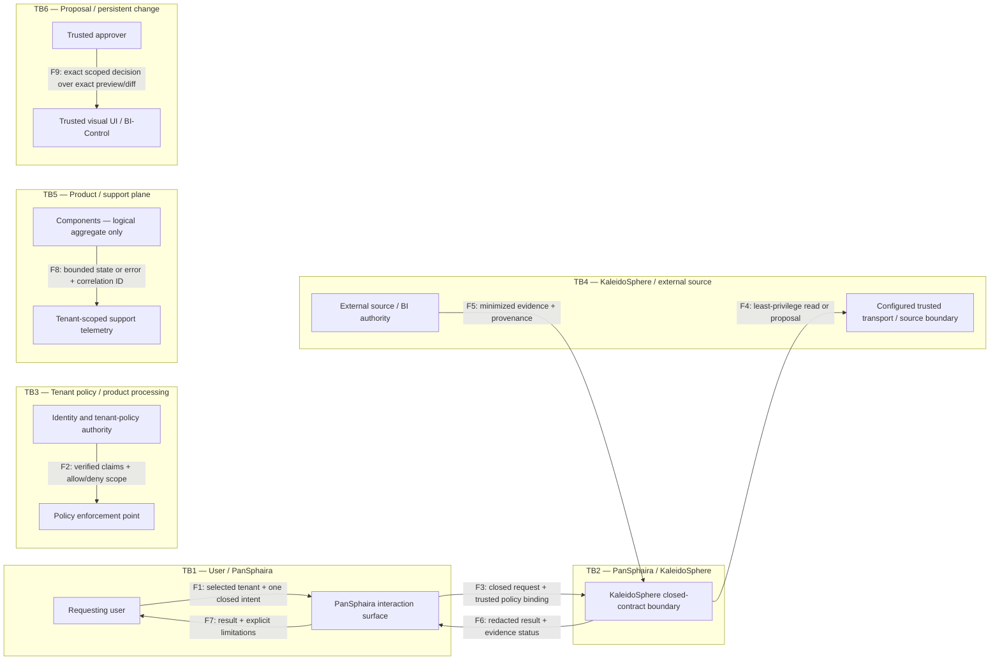

# Remote Connector Product Boundary and Threat Model

> **Status: FUTURE_BACKLOG — discovery-only planning artifact.**
>
> This document defines a candidate product boundary for issue #89. It does not
> authorize implementation, runtime activation, customer onboarding, network
> egress, deployment, or processing of live customer data.

## 1. Purpose and decision status

This artifact freezes the vocabulary and boundary inputs used by this discovery
threat model and needed for later build/buy/reject work. It describes a
hypothetical remote connector between a PanSphaira interaction surface and
KaleidoSphere's existing closed,
authority-free contract. It is not a design approval or evidence that such a
connector exists.

The only in-bound KaleidoSphere intents remain exactly `status`, `discovery`,
`analyze`, `plan`, `preview`, and `readback`. Discovery must not widen that set.
All persistent effects remain outside this connector boundary.

## 2. Actors and users

| Actor | Legitimate need | Authority held | Authority not held |
| --- | --- | --- | --- |
| Requesting user (for example, analyst) | Ask a bounded BI question and inspect evidence | Author a request within policy granted by the tenant | Select another tenant, bypass policy, supply free-form execution instructions, or approve persistent change |
| Tenant data owner | Define permissible data purpose, scope, classification, and retention | Approve the tenant's business use and data-governance policy | Change KaleidoSphere contracts or operate product infrastructure |
| Tenant administrator | Bind tenant identity, roles, approved resources, and support contacts under an approved future service design | Administer only the represented tenant | Read another tenant, weaken mandatory product guards, or grant KaleidoSphere new intent authority |
| Trusted approver | Review an exact preview/diff in a trusted visual UI | Approve or deny the exact represented change under a separate BI-Control workflow | Grant standing, voice-only, connector-level, or cross-tenant mutation authority |
| Support operator | Diagnose availability and contract failures from minimized telemetry | Perform documented operational support within assigned tenant and environment scope | Inspect business content by default, impersonate a user, change tenant policy, or treat a failed request as approved |
| Product/security owner | Own product contract, risk acceptance, release gates, and incident policy | Approve future product changes through separate governance | Act as tenant data owner or silently expand customer-data use |
| External BI/source system owner | Operate the authoritative data system and its access policy | Decide source-system access and remain authoritative for source data | Delegate source truth, identity decisions, or write authority merely by returning data |
| Untrusted party or content | None; modelled to make abuse explicit | No legitimate authority | Inject instructions, replay evidence, cross tenant boundaries, discover configuration, or cause execution |

A person may occupy multiple roles, but each action must be evaluated under one
explicit role and tenant binding. Role coincidence does not collapse separation
of duties.

## 3. Tenant model

A **tenant** is the smallest independently governed customer or organizational
security domain. Each future request, policy decision, resource reference,
evidence object, telemetry record, support action, and approval would need one
unambiguous tenant binding. An opaque principal identifier may identify a user
inside that tenant; human-readable personal data is not required for routing.

The boundary assumes deny-by-default isolation:

- no implicit, caller-selected, or fallback tenant;
- no cross-tenant query, cache reuse, evidence reuse, logs, support access, or
  approval;
- no inference that two matching resource names refer to the same resource;
- no global administrator access implied by product support;
- no tenant may weaken mandatory contract or integrity checks;
- ambiguous, missing, stale, or conflicting tenant context fails closed.

Whether a future offering is single-tenant, dedicated per tenant, or shared with
strong logical isolation remains an unresolved architecture decision. This
artifact defines required semantics but claims no implemented tenant isolation.

## 4. Authority ownership

### 4.1 PanSphaira

PanSphaira owns the user interaction: capturing the user's selected tenant and
closed intent, presenting limitations and results, preserving explicit user
choices, and routing an already valid request through a separately trusted
transport. It may offer non-binding visual guidance.

PanSphaira does **not** become authoritative for identity, tenant membership,
source facts, BI truth, KaleidoSphere contract validity, evidence integrity,
approval, persistent mutation, or implementation decisions. User-entered text,
voice, UI state, and visual appearance are untrusted claims until independently
validated by the authority that owns each decision.

### 4.2 KaleidoSphere

KaleidoSphere owns validation of its closed six-intent contract, capability and
request/result binding, evidence classification, integrity/freshness checks,
and separation of observed facts, computed facts, inferred candidates, and
human decisions. It must fail closed when those facts cannot be established.

KaleidoSphere does **not** own tenant identity proof, source-system access
policy, source truth, user approval, or persistent write authority. A validated
request is a proposal to use an already configured trusted transport; it neither
discovers a transport nor grants access.

### 4.3 Independent authorities

- The identity and tenant-policy authority establishes principal, membership,
  role, and allowed resources.
- The external source/BI system remains authoritative for access enforcement and
  returned source state.
- A trusted visual UI and BI-Control remain the only candidate path for a future
  persistent change: exact preview/diff, scoped approval, apply, independent
  readback, and rollback. That path is outside discovery and is not authorized
  here.
- Human data owners own purpose and risk decisions; product components must not
  infer consent or approval from successful transport, analysis, or presentation.

## 5. Minimized data classes

| Data class | Minimum candidate content | Handling boundary |
| --- | --- | --- |
| Request control data | Contract version, one closed intent, bounded arguments, correlation identifier | No arbitrary instructions, free SQL, provider payload, or access material |
| Tenant and principal claims | Opaque tenant and principal identifiers, role/policy references, decision time | Must be independently verified; minimize personal attributes |
| Resource references | Opaque allowlisted resource identifiers and requested scope | Names are not authority; bind to tenant and policy decision |
| Capability/contract evidence | Product identity, contract version, capability digest, request/action binding | Reject missing, malformed, stale, replayed, or mismatched evidence |
| BI evidence | Necessary metadata, aggregates, classifications, provenance, and limitations | Prefer metadata and aggregates; no raw source rows during discovery |
| Proposal/preview data | Non-applying plan, exact diff reference, preconditions, expiry | Never evidence of approval or execution |
| Result/readback evidence | Outcome, integrity/freshness facts, provenance, limitations, uncertainty | Redact and tenant-bind before presentation or retention |
| Operational telemetry | Timestamp class, correlation identifier, component state, bounded error code | No business payload by default; tenant-scoped access and retention |
| Human decision record | Exact decision, actor role, tenant, scope, time, expiry | Separate from system inference; no reusable standing approval |

Live customer records and access material are prohibited inputs to this discovery
work. Synthetic examples, if later needed, must be non-customer, non-secret, and
clearly labelled.

## 6. Directional data-flow inventory

This is a logical inventory, not a network design. Every arrow is conditional on
future approval and an already configured trusted transport.

| Flow | Direction | Minimum payload | Receiver responsibility | Prohibited payload/effect |
| --- | --- | --- | --- | --- |
| F1 | Requesting user → PanSphaira | Selected tenant, one closed intent, bounded input | Preserve user choice; label unverified claims | Access material, raw rows, arbitrary execution, implied approval |
| F2 | Identity/tenant authority → policy enforcement point | Verified tenant/principal/role claims and allow/deny scope | Bind decision to request, resource, time, and tenant | Caller-authored identity or fallback tenant |
| F3 | PanSphaira → KaleidoSphere boundary | Validated closed request, tenant/policy binding, correlation identifier | Revalidate closed schema and capability binding | Unknown fields, new intents, transport discovery, write command |
| F4 | KaleidoSphere → configured trusted transport/source boundary | Least-privilege, tenant-bound read/proposal request | Enforce source access independently | Direct access discovery, free SQL, raw provider payload, mutation |
| F5 | Source/BI authority → KaleidoSphere | Minimized metadata/aggregate evidence plus provenance and outcome | Verify integrity, freshness, request binding, and classification | Unbound, cross-tenant, stale, or raw-row discovery response |
| F6 | KaleidoSphere → PanSphaira | Tenant-bound redacted result, evidence status, limitations, nonclaims | Preserve evidence classes and uncertainty | Claim of truth, approval, compliance, or execution not in evidence |
| F7 | PanSphaira → requesting user | Human-readable result and explicit limitations | Keep proposals distinct from observed/read-back state | Visual appearance as correctness or authority |
| F8 | Components → tenant-scoped support telemetry | Bounded state/error code and correlation identifier | Apply least privilege, retention, and audit | Business content, access material, cross-tenant aggregation by default |
| F9 | Trusted approver → trusted UI/BI-Control | Exact scoped decision over an exact preview/diff | Enforce expiry, apply separately, read back, support rollback | Discovery-side apply, voice-only approval, standing approval |

F9 documents an external authority dependency only. It is not part of the
proposed discovery connector and grants no implementation or runtime authority.

## 7. Trust boundaries

| Boundary | Untrusted side | Required decision at crossing | Fail-closed condition |
| --- | --- | --- | --- |
| TB1 User/PanSphaira | User input, voice transcription, client state, rendered UI | Closed input shape and explicit tenant selection | Ambiguous intent/tenant, hidden field, or unsupported action |
| TB2 PanSphaira/KaleidoSphere | Client request and client-authored summaries | Contract, capability, tenant/policy, and request binding | Unknown field/intent, stale contract, absent trusted transport |
| TB3 Tenant policy/product processing | Principal and resource claims | Independently verified tenant role and least-privilege scope | Missing, conflicting, expired, or cross-tenant binding |
| TB4 KaleidoSphere/external source | Remote response and source-originated content | Source authorization, provenance, integrity, freshness, classification | Untrusted origin, raw-row discovery, replay, mismatch, uncertain outcome |
| TB5 Product/support plane | Telemetry and support request | Tenant-scoped support authorization and data minimization | Business payload exposure, impersonation, or cross-tenant access |
| TB6 Proposal/persistent change | Analysis, plan, preview, or conversational assent | Exact trusted-UI approval followed by separate BI-Control controls | Any attempt to treat discovery, plan, preview, or voice as apply authority |

The threat-model slice below enumerates discovery-level threats and mitigations
against every boundary above. The frozen boundaries do not claim implementation
or completeness beyond this bounded discovery analysis.

### 7A. Authority and data-flow diagram

The following discovery-level diagram supplies that later per-boundary analysis.
It is a rendering of F1–F9 and TB1–TB6 above, not a network topology. An arrow is
present only when the directional inventory declares it; subgraph placement
shows an authority/trust boundary and does not create an additional flow. In
particular, no arrow leaves the trusted UI/BI-Control plane toward an apply,
write, or deployment target.

Boundary coverage is exact: TB1 is crossed by F1/F7, TB2 by F3/F6, TB3 by F2,
TB4 by F4/F5, TB5 by F8, and TB6 by F9. The policy enforcement point and the
configured transport are logical receivers already named by F2 and F4; their
placement claims neither a component implementation nor a new edge. F9 remains
an external authority dependency, not a discovery-connector capability.

### 7B. STRIDE-style threat register

This register is a discovery threat model, not proof that a control is
implemented. **Impact class** uses `C` (confidentiality), `I` (integrity), `A`
(availability), and `AUTH` (authority/tenant separation). “Detection evidence”
is the minimum evidence a separately authorized future implementation would
have to produce; no such runtime evidence is claimed here. Every mitigation
must deny or stop on missing, ambiguous, conflicting, stale, or unverifiable
inputs rather than downgrade the check.

| Threat ID / STRIDE | Boundary / asset | Scenario | Precondition | Impact class | Fail-closed mitigation | Detection evidence | Owner | Residual risk | Explicit nonclaim |
| --- | --- | --- | --- | --- | --- | --- | --- | --- | --- |
| TM-TB1-01 / Spoofing | TB1; tenant and principal selection | Caller-authored identity or tenant text is treated as verified context. | A request can carry an unverified or fallback identity/tenant claim. | AUTH, C, I | Ignore caller authority claims; require an independently verified, request-bound tenant/policy decision; deny missing, ambiguous, or conflicting context. | Future denial receipt naming the failed trusted-binding check, with minimized correlation facts and no caller claim echoed as truth. | Identity/tenant-policy owner; PanSphaira owner for capture fidelity | A compromised identity authority remains outside product verification and requires separate governance. | No identity proof, tenant resolver, or implemented denial control is claimed. |
| TM-TB1-02 / Tampering, Elevation of privilege | TB1; closed External API v2 intent contract | Prompt, voice text, hidden field, or UI state introduces a seventh intent or semantically widens one of the six intents. | Untrusted content reaches request shaping. | I, AUTH | Parse against the exact six-intent allowlist and bounded schema; reject unknown fields, aliases that widen semantics, arbitrary instructions, and unsupported actions before dispatch. | Future negative contract result recording intent/schema mismatch and zero dispatch. | PanSphaira owner; KaleidoSphere contract owner | Natural-language ambiguity can persist; ambiguity must remain a denial, not inferred intent. | No new intent, semantic widening, parser, or dispatch path is authorized or claimed. |
| TM-TB2-01 / Tampering | TB2; contract, capability, and request/result binding | Client-authored summary, stale capability statement, or altered correlation data substitutes for authoritative raw evidence. | The crossing accepts client summaries or unbound metadata. | I, AUTH | Revalidate closed schema and trusted capability/contract evidence; require exact request/result/tenant binding and freshness; reject summaries as authority. | Future validation receipt identifying contract version, binding outcome, and freshness class without sensitive payload. | KaleidoSphere contract/security owner | An authoritative issuer compromise is not solved by binding checks alone. | No capability issuer, trusted transport, attestation implementation, or evidence validity is claimed. |
| TM-TB2-02 / Denial of service | TB2; bounded request handling | Repeated malformed, oversized, unknown-intent, or absent-transport requests consume processing or trigger unsafe retries. | Untrusted requests can repeatedly cross TB2. | A, AUTH | Bound shape and work before dispatch; deterministically reject; perform no blind retry, role broadening, or fallback transport selection. | Future bounded rejection counters and correlation metadata, tenant-scoped and free of business content. | KaleidoSphere owner; transport operator for separately authorized transport availability | Volumetric abuse may still require controls outside this artifact. | No rate limit, capacity, service level, transport, or availability posture is claimed. |
| TM-TB3-01 / Spoofing, Elevation of privilege | TB3; tenant role and resource scope | A principal, resource name, cached policy, or support role is used for another tenant or broader role. | Tenant/resource binding is absent, stale, conflicting, or inferred from a name. | AUTH, C, I | Require independently verified tenant, principal, role, resource, request, and decision-time binding; deny cross-tenant, expired, missing, or conflicting scope; never retry under a broader role. | Future policy-decision identifier and allow/deny reason bound to tenant, resource, request, and time. | Identity/tenant-policy owner | Policy-authority misconfiguration remains possible and needs independent audit. | No tenant isolation, policy engine, role mapping, or cross-tenant safety is claimed implemented. |
| TM-TB3-02 / Repudiation | TB3; policy and human decision records | A user, administrator, or approver disputes a decision because actor role, tenant, exact scope, or expiry was not bound. | Decisions are summarized, mutable, or reusable as standing authority. | I, AUTH | Accept only an exact, scoped, expiring decision from its owning authority; deny absent or mismatched decision facts and preserve minimized immutable audit facts. | Future decision record containing exact decision, authority, role, tenant, scope, time, expiry, and request binding. | Identity/tenant-policy owner; trusted-approval owner for approvals | Authorized-account misuse can still produce a formally valid decision. | No non-repudiation guarantee, legal validity, audit store, or approval workflow is claimed. |
| TM-TB4-01 / Information disclosure | TB4; access material and customer/source data | Credentials, access material, live customer data, or raw source rows are solicited, accepted, propagated, or retained during discovery. | Discovery input or a remote response contains a prohibited class. | C, AUTH | Prohibit solicitation and processing; stop on detection, avoid propagation/retention, accept no evidence from the response, and invoke separately approved incident handling. | Discovery content scan plus, only in a future authorized system, minimized prohibited-class denial/incident evidence with no secret or business payload. | Product security/privacy owner; tenant data owner for incident decisions | Detection may miss transformed sensitive content; that uncertainty cannot authorize processing. | No credential handling, customer-data fitness, incident procedure, source access, or privacy compliance is claimed. |
| TM-TB4-02 / Tampering, Spoofing | TB4; source provenance and result evidence | Stale, replayed, cross-tenant, wrong-request, or source-spoofed evidence is presented as current source state. | Provenance, tenant, request, capability, integrity, or freshness binding is absent or accepted from the payload itself. | I, AUTH, C | Require independently verifiable provenance plus exact tenant/request/capability binding and freshness; reject replay, mismatch, uncertainty, and all cross-tenant evidence without partial use. | Future verification receipt showing each binding/freshness decision and a denial reason; raw evidence is not logged by default. | KaleidoSphere contract/security owner; external source/BI owner for source state | A compromised authoritative source may return internally consistent false data. | No source correctness, provenance mechanism, freshness window, integrity control, or evidence acceptance is claimed. |
| TM-TB4-03 / Elevation of privilege | TB4; source-originated content | Source metadata or returned text injects instructions, a transport target, a broader query, or an apply action. | Remote content is interpreted as control data rather than classified evidence. | I, AUTH | Treat all source-originated content as untrusted data; enforce the original closed request and allowlisted resource scope; reject control-like content and perform no derived action. | Future classification/contract denial bound to the original request, with zero secondary dispatch or action. | KaleidoSphere contract/security owner | Novel encodings may evade classifiers; uncertain classification must fail closed. | No content classifier, provider adapter, source query, secondary dispatch, or execution facility is claimed. |
| TM-TB5-01 / Information disclosure | TB5; telemetry and support plane | Business payload, access material, personal data, or cross-tenant facts enter logs or support views. | Components emit verbose errors or support access is broad/global. | C, AUTH | Emit bounded codes and correlation facts only; tenant-bind retention and access; deny support access on absent scope; stop and contain prohibited payload exposure. | Future schema validation/redaction result and tenant-scoped support-access audit, neither containing business content. | Product security/privacy owner; product support owner | Correlation and timing metadata may still be sensitive and require later retention decisions. | No telemetry system, retention period, residency, support tooling, or support commitment is claimed. |
| TM-TB5-02 / Repudiation, Elevation of privilege | TB5; operator actions | A support operator impersonates a user, changes policy, or performs an untraceable cross-tenant action to resolve an incident. | Support and product authority are conflated or operator actions lack tenant scope. | AUTH, C, I | Separate support from user/policy authority; require explicit tenant/environment assignment and auditable bounded actions; deny impersonation, policy mutation, and unresolved ownership. | Future operator-action audit with assigned tenant/environment, bounded action class, outcome, and escalation. | Product support owner; product/security owner for escalation | Privileged-operator compromise remains a governance risk. | No operator console, privileged-access model, staffing level, response time, or audit implementation is claimed. |
| TM-TB6-01 / Elevation of privilege | TB6; proposal versus persistent-change authority | `discovery`, `analyze`/analysis, `plan`, or `preview` output—or conversational/voice assent—is treated as delivery, approval, apply, execution, or readback. | Proposal and persistent-change states are conflated. | AUTH, I | Keep discovery non-applying; accept no approval at the connector; require a separate exact trusted-UI decision and separate BI-Control apply/readback controls; deny absent, stale, generalized, or mismatched approval. | Future state-transition evidence proving preview, decision, apply outcome, and independent readback are distinct and exactly bound. | Trusted-approval owner; BI-Control owner | Trusted UI or approver compromise remains possible and needs separate threat analysis before authorization. | No approval, apply, write, rollback, readback, delivery, or persistent-change workflow is built or authorized. |
| TM-TB6-02 / Tampering, Repudiation | TB6; exact preview/diff and human decision | The represented preview changes after review, or a prior/standing approval is replayed for a different scope, tenant, or action. | Approval is not bound to immutable content, tenant, actor role, preconditions, and expiry. | I, AUTH | Deny unless the exact decision binds the exact preview/diff, tenant, actor role, scope, preconditions, and expiry; require separate independent readback and preserve unknown outcome on mismatch. | Future exact-content binding result, expiring decision record, apply outcome, and separately sourced readback evidence. | Trusted-approval owner; BI-Control owner | Human misunderstanding of an exact preview is not eliminated by technical binding. | No preview digest scheme, trusted UI, approval validity, apply mechanism, or readback implementation is claimed. |
| TM-ALL-01 / Tampering | TB1–TB6; declared flow inventory | A discovery document, model, or later design invents an undeclared data-flow edge and uses the diagram as authority for transport, data access, support access, or mutation. | A new arrow or changed direction lacks an approved inventory entry and authority owner. | AUTH, C, I | Treat F1–F9 as a closed discovery inventory; reject any unmatched edge, direction change, or side effect and require separate governance rather than normalizing it into this model. | Deterministic diagram-to-inventory coverage check and review evidence mapping every arrow to exactly one declared flow and boundary. | Product/security owner | Textual diagrams cannot prove runtime topology; later architecture must be independently verified. | The diagram is not implementation authorization, network evidence, an endpoint inventory, or proof that any edge exists. |

The register covers every declared trust boundary and all six STRIDE categories.
It does not accept risk, select architecture, or authorize a control. Residual risks
remain inputs to later governance, not implied approval.

### 7C. Mandatory negative discovery cases

These cases are normative discovery gates. “Reject” means stop the affected
analysis path, do not dispatch, apply, retain, broaden, infer success, or convert
the input into implementation guidance. A prose warning without the specified
negative outcome is not a pass.

| Negative case | Prohibited discovery input or claim | Mandatory fail-closed outcome | Required discovery evidence | Nonclaim |
| --- | --- | --- | --- | --- |
| NEG-01 Credentials or live customer data | Any credential/access material, live customer record, raw source row, or request to obtain, validate, store, rotate, broker, or use it during discovery. | Reject and stop; do not echo, propagate, retain, test, or substitute a “temporary” value; escalate only under separately approved incident policy. | Content check confirms the artifact contains no value or record and states the prohibition and denial behavior. | No credential handling, source access, customer-data processing, or incident execution is authorized. |
| NEG-02 Seventh or semantically widened intent | Any seventh External API v2 intent, alias, unknown field, free-form action, or reinterpretation that widens `status`, `discovery`, `analyze`, `plan`, `preview`, or `readback`. | Reject before dispatch; do not map it to a nearby intent, split it into hidden actions, or change one of the six semantics. | Exact six-intent allowlist appears in the artifact; negative text denies both a seventh intent and semantic widening. | No contract change or new capability is approved. |
| NEG-03 Discovery as delivery or authority | Any claim that discovery, analysis/`analyze`, plan, or preview is delivery, approval, apply, execution, or readback; any claim that transport or presentation success proves one of those states. | Reject the state transition; preserve proposal/non-applying status and unknown/denied outcome; require distinct future authority evidence outside this connector. | Negative text names every prohibited source state and target claim; diagram contains no apply/write edge. | No delivery, approval, apply, execution, persistent effect, or readback is claimed. |
| NEG-04 Caller-authored identity or tenant | Identity, membership, role, resource authority, or tenant supplied by caller text, voice, client state, UI appearance, fallback, or matching resource name. | Ignore as authority and deny unless independently verified and exactly bound to tenant, request, resource, role, and time; never choose a default tenant. | Threat/register entry and boundary rule require independent verification and denial for missing, ambiguous, conflicting, or cross-tenant context. | No identity or tenant assertion is verified by this artifact. |
| NEG-05 Invented data-flow edge | Any arrow, reverse flow, side channel, retry path, discovery mechanism, support path, or persistent-effect edge not declared as F1–F9. | Reject the model/design delta; do not infer authorization from convenience or diagram placement; require a separately governed boundary change. | Diagram arrows map only to F1–F9, with TB1–TB6 coverage stated and no outgoing apply/write/deploy edge. | The declared arrows are logical discovery inventory, not proof of runtime existence. |
| NEG-06 Stale, replayed, or cross-tenant evidence | Evidence with expired/unknown freshness, prior-request reuse, tenant mismatch, ambiguous provenance, wrong capability/contract, or self-asserted binding. | Reject the entire evidence object; do not partially use it, refresh by broadening authority, merge tenants, retry as another role, or report success/readback. | Threat/register entry requires provenance, integrity, freshness, tenant, request, and capability checks with explicit denial evidence. | No evidence object is accepted as fresh, authentic, tenant-safe, or correct here. |

Passing these documentation cases establishes only that this artifact states the
required negative contract. It does not test a runtime, approve implementation,
or satisfy later architecture, privacy, legal, compliance, support, or release
gates.

## 8. Failure modes and ownership

| Failure mode | Required behavior | Primary owner | Support handoff |
| --- | --- | --- | --- |
| Missing trusted transport | Stop after local validation; report the missing dependency | Product owner | Product support, without soliciting access material |
| Unknown or widened intent/field | Reject without dispatch | KaleidoSphere contract owner | Product/security for repeated probes |
| Missing or ambiguous tenant/principal | Deny; do not guess or use a default | Identity/tenant-policy owner | Tenant administrator |
| Cross-tenant reference, cache, evidence, or telemetry | Deny, contain, preserve minimized audit facts, initiate incident process | Security owner | Affected tenant data owner and product support |
| Source authorization denied | Preserve denial; do not retry as a broader role | External source owner | Tenant administrator/source support |
| Integrity, capability, request-binding, freshness, or replay check fails | Accept no evidence and fail closed | KaleidoSphere contract/security owner | Product support with correlation metadata only |
| Raw row, access material, or other prohibited class appears | Stop processing, avoid propagation/retention, invoke incident policy | Security/privacy owner | Tenant data owner under approved incident procedure |
| Timeout or transport uncertainty | Report unknown/failed outcome; no blind retry or success claim | Transport operator | Product support and source operator |
| Partial, malformed, or conflicting result | Reject as evidence; show no inferred success | KaleidoSphere contract owner | Product support |
| Stale policy or approval | Deny and require a fresh scoped decision | Tenant-policy or trusted-approval owner | Tenant administrator/approver |
| Presentation differs from evidence | Preserve authoritative evidence, flag discrepancy, do not infer correctness from UI | PanSphaira owner | Product support |
| Support cannot resolve ownership | Escalate to product/security owner; no broadened access | Product owner | Tenant contact receives status without sensitive detail |

Failures never transfer authority. Availability pressure, support access, retries,
or a plausible UI result must not turn a deny/unknown outcome into success.

## 9. Support ownership model

- **PanSphaira owner:** interaction defects, explicit tenant/intent capture,
  presentation fidelity, accessibility of limitations, and client-side redaction.
- **KaleidoSphere owner:** closed-contract validation, evidence class separation,
  attestation checks, deterministic denial, and result nonclaims.
- **Identity/tenant-policy owner:** principal lifecycle, tenant membership, roles,
  resource policy, and access-decision audit.
- **Transport operator:** availability and bounded delivery of an already
  configured trusted transport, without changing semantic authority.
- **External source/BI owner:** source access enforcement, source-state accuracy,
  and source-side incident response.
- **Tenant data owner:** business purpose, classification, retention, permitted
  use, and tenant incident decisions.
- **Product security/privacy owner:** threat acceptance, cross-tenant or prohibited
  data incidents, security disclosure, and approval gates for any future build.

No 24/7, response-time, residency, retention, disaster-recovery, or customer
support commitment is selected. A later decision must assign these obligations
before any implementation authorization.

## 10. Explicit non-goals

This discovery artifact does not:

1. build, host, configure, activate, test, deploy, or operate a connector or MCP
   service;
2. define or expose a public endpoint, transport address, discovery mechanism, or
   deployment procedure;
3. collect, validate, store, rotate, broker, or request access material;
4. process live customer records or authorize customer onboarding;
5. add an intent or alter the semantics of the six External API v2 intents;
6. accept free SQL, raw source rows, arbitrary URLs, provider payloads, unknown
   fields, direct DOM/JavaScript control, or arbitrary actions;
7. grant PanSphaira, KaleidoSphere, support staff, or an AI system source truth,
   tenant administration, approval, apply, write, delete, or deployment authority;
8. treat `discovery`, `analyze`, `plan`, `preview`, transport success, or visual
   presentation as delivery, approval, execution, or readback;
9. choose hosted, MCP, hybrid, buy, build, or reject; that evidence-bound decision
   belongs to a later issue #89 slice;
10. complete the later implementation blockers, approval register, architecture,
    or service design.

## 11. Nonclaims and assumptions

### Nonclaims

No connector, MCP service, public endpoint, tenant isolation control, remote
transport, production posture, compliance readiness, privacy certification,
customer-data fitness, support model, service level, marketplace presence,
operational cost, deployment readiness, or persistent-change workflow is claimed
to exist or be approved.

This document is not proof of security, implemented threat mitigations, legal
review, regulatory compliance, source correctness, identity assurance, production
readiness, or issue completion. `FUTURE_BACKLOG` remains in force.

### Assumptions requiring later validation

- The current closed six-intent contract is the immutable semantic ceiling for
  this discovery; any proposed widening is rejected rather than assessed here.
- A future design can receive independently verified tenant and principal claims
  without making PanSphaira or KaleidoSphere the identity authority.
- External sources can enforce tenant-scoped least privilege and return minimized,
  provenance-bearing evidence rather than raw rows.
- A trusted transport, if ever approved, can be configured out of band without
  user-supplied transport discovery or access material entering requests.
- Any persistent action remains separable from discovery and can require exact
  trusted-UI approval, BI-Control apply, independent readback, and rollback.
- Data retention, residency, cost, compliance, service level, tenancy architecture,
  and support staffing are unresolved and must not be inferred from this boundary.

## 12. Change control

This file may be archived or superseded without runtime rollback because it
creates no runtime behavior. Any implementation proposal requires a separate,
explicitly approved work item after dependency, threat, privacy, compliance,
support, and architecture gates. Discovery evidence alone is never that approval.
