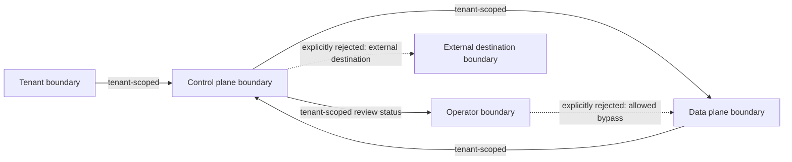

# FUTURE_BACKLOG — Tenant Data and Secret Egress Boundary

Planning-only memo envelope. This document is not an implementation approval,
release record, or operational runbook.

Sole allowed document path: `docs/future/remote-connector/TENANT_DATA_SECRET_EGRESS.md`.

## Scope and admission

This memo is limited to a reviewed boundary contract, synthetic evidence, and
deterministic local validation for a possible future remote connector. It has
no live data, credentials, endpoint, onboarding, deployment, database
connection, customer-data path, or production logging.

Admission condition: only this planning envelope may be admitted now. An
implementation may be considered only after a separately reviewed,
versioned contract supersedes this planning document and supplies evidence for
every required boundary and safety decision. Nothing in this memo admits an
implementation or changes a product, network, API, secret, service, or
customer boundary.

Hard reject conditions: reject the candidate and do not continue if it
authorizes or requires any of the following:

- an endpoint, URL, network route, or remote egress;
- tenant or customer onboarding, enrollment, or provisioning;
- credential capture, storage, transport, or secret material;
- deployment, release, service activation, or production operation;
- a database or source connection, query execution, or source-row access;
- live data, customer data, or a customer-data path;
- production logging, telemetry, or operational observability.

The rejection must be represented by a stable denial code and evidence, with
no candidate content echoed. Unknown scope, an ambiguous outcome, or any
authority not explicitly present in the v1 contract is also a hard reject.

Status: `FUTURE_BACKLOG` / planning-only bounded decision/integration receipt for
PLAN-KS91-BOUNDARY-CONTRACT-01. Freezes the tenant-data and secret egress
boundary of the future remote-connector surface as of product v0.24.0. The
remote connector is not implemented in v0.24.0; nothing in this receipt
changes the product, its network posture, or the existing external API.

Local package completion is self-contained: no waiting, owner, or external
completion node is created. `FUTURE_BACKLOG` remains the nonterminal status of
the valid requirements artifact; local validation records evidence but does not
release or hand off the future surface. The separate issue #91 implementation
decision below is terminal `REJECTED_WITH_EVIDENCE` for implementation now.

## Context

KaleidoSphere v0.24.0 exposes no remote-connector surface. The repository
security posture (docs/SECURITY.md) is that tenant source rows and credential
material never egress to models, Superset, or logs; only `bi-control` holds a
source-egress network; and absence is reported through typed coverage states
and blind-spot labels rather than through claims.

A future remote connector would be the first surface that could plausibly move
evidence out of the product boundary. Operating Model v1.1 and decisions
D-001 through D-007 (already reviewed by the controller) require such a
surface to be frozen before implementation, not after. This receipt freezes
it. This receipt preserves those decisions and invents no new process
variant.

## Decision

The v1 boundary is a fail-closed, versioned contract with a canonical
SHA-256 self-digest, checked by a deterministic validator:

- Contract: `docs/future/remote-connector/fixtures/tenant-data-secret-egress-contract-v1.json`
- Negative cases: `docs/future/remote-connector/fixtures/tenant-data-secret-egress-negative-cases-v1.json`
- Validator: `scripts/future/validate-tenant-data-secret-egress.mjs`
- Focused tests: `tests/future/validate-tenant-data-secret-egress.test.mjs`

Contract digest (review marker):
`sha256:1d85323fc72d4e5282e68050ff6fedc96ed5c0eded0420ca688ba63636ead4fa`

The contract status is `FROZEN_FUTURE_SURFACE` and its policy is
`default: DENY`. An egress envelope is accepted only if:

- its surface is exact — closed key sets, exact schema versions, bounded
  item count — and its data tree is plain: no proxies, accessor or
  non-enumerable keys, symbol keys, cycles, non-finite numbers, or
  negative zero;
- its attestation binds the shipped contract's product version, schema
  version, and self-digest;
- all four authority flags (`sourceRowsIncluded`, `secretsIncluded`,
  `rawSqlIncluded`, `freeformIncluded`) are `false`;
- every item is one of five permitted classes with an exact shape:
  `aggregate-count`, `blind-spot-label`, `coverage-state`,
  `evidence-digest`, `object-identifier`. Blind-spot labels come from a
  closed label set, coverage states from a closed state set, and engine
  identifiers from the closed set `mssql`/`oracle`.

Six classes are denied by name: `connection-configuration`,
`credential-material`, `raw-definition-text`, `source-row-material`,
`sql-statement`, `unenumerated-freeform`. Any other class is denied by
default. Denial output is a stable denial code only; candidate content is
never echoed.

## Safety boundary

This receipt changes no product code, no network configuration, no secret
file layout, and no Superset boundary. It contains no live credentials and
no source rows; fixture identifiers are neutral labels. The validator is
deterministic over its inputs and writes nothing to the repository.

The contract fixture is synthetic evidence only. Its identifiers, counts,
digests, labels, and coverage states are test values; they are not an
observation of a tenant, source system, credential store, deployment, or
production log.

## Integration contract

A future remote-connector implementation must:

- validate every egress envelope with
  `validateTenantDataSecretEgressEnvelopeV1` against the shipped contract
  and treat any thrown denial code as terminal;
- add or rename egress classes only through a new contract version
  (v2 or later) with a new digest, never by widening v1;
- keep `externalApiV2Changed`, `supersetBoundaryChanged`, and
  `secretFileLayoutChanged` false in every version it ships;
- run the validator self-check and the focused test suite before merge,
  with the contract digest recorded as the review marker.

## Evidence

- `node scripts/future/validate-tenant-data-secret-egress.mjs --memo docs/future/remote-connector/TENANT_DATA_SECRET_EGRESS.md --dry-run` prints
  `TENANT_DATA_SECRET_EGRESS_FUTURE_MEMO_VALIDATION_PASSED planningStatus=FUTURE_BACKLOG disposition=NONTERMINAL terminal=false implementationDisposition=REJECTED_WITH_EVIDENCE implementationDecision=REJECT_IMPLEMENTATION_NOW components=7 criteria=15 contractDigest=sha256:1d85323fc72d4e5282e68050ff6fedc96ed5c0eded0420ca688ba63636ead4fa validCases=2 negativeCases=11 envelopeNegativeCases=16`
  and exits 0.
- `node --test tests/future/validate-tenant-data-secret-egress.test.mjs`
  covers the exact dry-run command and its unresolved-reference rejection.
- `git diff --check origin/main...HEAD` reports no whitespace errors.

## Data classification, residency, retention, and deletion

This companion decision is still planning-only and preserves Operating Model
v1.1 and decisions D-001 through D-007. It introduces no process variant and
authorizes no connector, egress, onboarding, or live-data path. The complete
machine-readable artifact is
`docs/future/remote-connector/fixtures/data-classification-retention-v1.json`.
The fixture and its focused test use synthetic categories and neutral labels
only; `synthetic-fixture-only` is an evidence boundary, not a production data
classification claim.

### Residency choices

Residency is selected before any future handling and is bound to the explicit
tenant boundary. The v1 synthetic choices are:

| Choice | Residency label | Permitted synthetic tenant boundary |
| --- | --- | --- |
| `synthetic-eu-1` | `synthetic-eu` | `synthetic-tenant-alpha-isolated`, `synthetic-tenant-gamma-isolated` |
| `synthetic-us-1` | `synthetic-us` | `synthetic-tenant-beta-isolated` |

An absent, unknown, or incompatible choice is denied. A region/residency
mismatch is terminal: the candidate is rejected rather than remapped to a
different region. The tenant boundary is isolated and must be present on every
matrix row.

### Data classification and retention/deletion matrix

The Data classification and retention matrix below remains synthetic and
planning-only. This remains synthetic-only evidence.

All categories below are synthetic labels. Sensitivity is deliberately
relative to this fixture and does not describe a live tenant. Every row has a
finite duration, an explicit trigger, an owner, an exact residency choice, and
a deletion verification requirement.

| Data category | Sensitivity | Tenant boundary | Permitted region choice | Retention trigger | Duration | Deletion verification | Owner | Unknown |
| --- | --- | --- | --- | --- | ---: | --- | --- | --- |
| `synthetic-aggregate` | `synthetic-low` | `synthetic-tenant-alpha-isolated` | `synthetic-eu-1` | `synthetic-intake-complete` | 1 day | `synthetic-manifest-absent-and-digest-zero` | `synthetic-data-governance` | `REJECT` |
| `synthetic-identifier` | `synthetic-moderate` | `synthetic-tenant-beta-isolated` | `synthetic-us-1` | `synthetic-review-decision-recorded` | 30 days | `synthetic-manifest-absent-and-digest-zero` | `synthetic-data-governance` | `REJECT` |
| `synthetic-sensitive-metric` | `synthetic-high` | `synthetic-tenant-gamma-isolated` | `synthetic-eu-1` | `synthetic-decision-closed` | 90 days | `synthetic-manifest-absent-and-digest-zero` | `synthetic-data-governance` | `REJECT` |

The retention choices are `dispose-after-intake` (1 day),
`dispose-after-review` (30 days), and `dispose-after-closure` (90 days).
### Retention and deletion rules

Each has a finite review point, a named review owner, and
`REJECT_AND_DELETE` when review is missing. Deletion is not complete until the
synthetic manifest is absent and its digest check is zero. No row may use
unbounded retention or an unspecified duration; both are rejected.

### Fail-closed reject matrix

The fixture includes mandatory negative cases for unbounded retention,
unspecified retention, and region/residency mismatch. It also rejects a
non-synthetic origin. Stable denial codes are emitted without echoing
candidate content:

| Condition | Denial code |
| --- | --- |
| Unbounded retention (`null` duration with an unbounded policy) | `KS91_RETENTION_UNBOUNDED_DENIED` |
| Unspecified retention (missing policy or duration) | `KS91_RETENTION_UNSPECIFIED_DENIED` |
| Region/residency mismatch | `KS91_RESIDENCY_MISMATCH_DENIED` |
| Non-synthetic/live origin | `KS91_LIVE_DATA_DENIED` |
| Unknown category, region, tenant boundary, or value | `KS91_UNKNOWN_*_DENIED` |

The focused check is `node --test
tests/future/data-classification-retention.test.mjs`. The slice closes only
with a finite, reviewable matrix and evidence for every rejection; an unknown
or ambiguous outcome closes as `REJECTED_WITH_EVIDENCE`.

## Tenant-isolation threat model

This companion threat model is planning-only synthetic evidence. It preserves
Operating Model v1.1 and decisions D-001 through D-007, introduces no process
variant, and authorizes no connector, egress, onboarding, live-data path, or
architecture implementation. The machine-readable model is
`docs/future/remote-connector/fixtures/tenant-isolation-threat-model-v1.json`
and its focused check is
`node --test tests/future/tenant-isolation-threat-model.test.mjs`.

### Isolation boundaries

- **Tenant boundary** owns one synthetic tenant namespace. `tenantId` and
  `tenantScope` are required and must identify the same tenant.
- **Control plane boundary** validates the tenant scope and routes only
  bounded requests; it has no cross-tenant authority.
- **Data plane boundary** stores and returns synthetic, tenant-partitioned
  evidence keyed by the validated tenant scope.
- **Operator boundary** receives only tenant-scoped review status and evidence;
  it is not a bypass around scope validation.
- **External destination boundary** is outside the product isolation boundary;
  no tenant data, secret, or synthetic evidence is sent there.

### Synthetic boundary/data-flow diagram

Every flow is either tenant-scoped or explicitly rejected. The four positive
flows bind source, destination, and data to the same tenant scope. The two
rejected flows represent external-destination egress and an operator bypass;
they carry no data. The fixture and test check both the named boundaries and
the complete flow set, rather than assuming an architecture implementation.

### Hard reject conditions

The model is fail-closed with `default: DENY`. Reject the input with a stable
code and do not echo candidate content when any of these conditions occurs:

| Condition | Denial code |
| --- | --- |
| Shared effective tenant identifier | `KS91_SHARED_TENANT_IDENTIFIER_DENIED` |
| Cross-tenant read | `KS91_CROSS_TENANT_READ_DENIED` |
| Cross-tenant write | `KS91_CROSS_TENANT_WRITE_DENIED` |
| Cross-tenant export | `KS91_CROSS_TENANT_EXPORT_DENIED` |
| Ambiguous tenant, control-plane, data-plane, operator, or external-destination boundary | `KS91_AMBIGUOUS_BOUNDARY_DENIED` |
| Allowed bypass or path that skips tenant-scope validation | `KS91_BYPASS_ALLOWED_DENIED` |

Missing tenant scope, unknown flows, live/non-synthetic input, and any flow
that is neither tenant-scoped nor explicitly rejected are also denied. No
shared identifier, cross-tenant read/write/export, ambiguous boundary, or
allowed bypass may be remapped into an accepted tenant-scoped flow.

## Candidate egress allowlist decision matrix

This companion artifact is a planning candidate, not a configured network control.
It preserves Operating Model v1.1 and decisions D-001 through D-007,
introduces no process variant, and authorizes no connector or egress. The
machine-readable matrix is
`docs/future/remote-connector/fixtures/egress-threat-allowlist-v1.json` and
the focused check is
`node --test tests/future/egress-threat-allowlist.test.mjs`.

The matrix names only synthetic, local logical destinations. It contains no
URL, hostname, CIDR, port, route, socket, provider, or configured firewall
rule. A row is therefore a reviewable planning candidate and not permission
to create a network rule. A future implementation would need a separately
reviewed versioned contract and an independently enforced control before any
destination could be configured.

### Tenant-scoped candidate matrix

Every candidate is bound to `request-tenant-only`; it cannot be resolved to a
shared tenant, another tenant, or an unbounded destination set. The approval
gate is required before use, and the default outcome remains `DENY` even for
the rows marked `ALLOW_CANDIDATE_ONLY`.

These tenant-scoped destinations are logical review targets only; they are not
network destinations.

| Candidate destination | Purpose | Tenant scope | Data class | Approval gate | Decision | Deny-default outcome |
| --- | --- | --- | --- | --- | --- | --- |
| `local-tenant-evidence-ledger` | Retain bounded aggregate evidence for review | `request-tenant-only` | `synthetic-aggregate` | Tenant-scope validation | `ALLOW_CANDIDATE_ONLY` | `DENY` |
| `local-tenant-coverage-ledger` | Record typed coverage states and evidence digests | `request-tenant-only` | `synthetic-coverage-state` | Tenant-scope validation | `ALLOW_CANDIDATE_ONLY` | `DENY` |
| `local-tenant-review-status` | Present scoped review status to the operator | `request-tenant-only` | `synthetic-scoped-review-status` | Tenant-scope validation and operator review | `ALLOW_CANDIDATE_ONLY` | `DENY` |
| `local-tenant-decision-record` | Retain a bounded sensitive metric for a scoped decision record | `request-tenant-only` | `synthetic-sensitive-metric` | Tenant-scope validation and data-governance review | `ALLOW_CANDIDATE_ONLY` | `DENY` |

The matrix intentionally does not list secret material or regulated data as a
positive candidate. Secret or regulated data requires a separate explicit
reviewed gate; absent that gate it is rejected. A purpose, tenant scope, data
class, approval gate, and deny-default outcome are mandatory fields for every
candidate row. Unknown or missing fields do not inherit a permissive default.

### Egress threats and hard rejects

The threat model treats uncontrolled egress as a loss of both destination and
tenant accountability. Fail closed with a stable denial code when a candidate
uses a wildcard or unbounded destination, is an unapproved destination, carries secret or
regulated data without its gate, is cross-tenant, is not an exact matrix
entry, or requests any real network operation. The mandatory negative case is
`reject-uncontrolled-egress`; it represents a destination not bound to the
candidate matrix and is denied without attempting a network request.

| Threat or condition | Stable denial code |
| --- | --- |
| Wildcard destination or wildcard pattern | `KS91_EGRESS_WILDCARD_DESTINATION_DENIED` |
| Unbounded destination set | `KS91_EGRESS_UNBOUNDED_DESTINATION_DENIED` |
| Missing completed approval gate | `KS91_EGRESS_APPROVAL_REQUIRED_DENIED` |
| Secret or credential material without an explicit gate | `KS91_SECRET_EGRESS_GATE_REQUIRED_DENIED` |
| Regulated data without an explicit gate | `KS91_REGULATED_EGRESS_GATE_REQUIRED_DENIED` |
| Uncontrolled egress | `KS91_UNCONTROLLED_EGRESS_DENIED` |
| Real network request, endpoint, host, route, port, or URL | `KS91_REAL_NETWORK_REQUEST_DENIED` |
| Shared or cross-tenant destination scope | `KS91_CROSS_TENANT_DESTINATION_DENIED` |
| Destination absent from the exact candidate matrix | `KS91_DESTINATION_NOT_ALLOWLISTED_DENIED` |

The policy is `default: DENY`. A denial is terminal and must not be changed
by a later allow, retry, operator bypass, or destination remapping. The test
exercises every shipped negative case locally using synthetic values only; it
does not open a socket, call an endpoint, or configure a network control.

## Secret-custody option matrix

This companion artifact is planning-only synthetic evidence. It preserves
Operating Model v1.1 and decisions D-001 through D-007, introduces no process
variant, and authorizes no secret store, connector, egress, onboarding, or live
credential path. The machine-readable matrix is
`docs/future/remote-connector/fixtures/secret-custody-options-v1.json` and the
focused check is `node --test tests/future/secret-custody-gates.test.mjs`.

The options are comparison inputs, not an implementation choice. Every option
must state its custody boundary, hypothetical access boundary, rotation and
revocation assumptions, audit requirements, approver, rejection trigger, and
approval gate. The default outcome is `DENY`; an approved row is only
`APPROVE_CANDIDATE_ONLY` and cannot authorize production use.

### Synthetic option comparison

All identifiers and review records below are synthetic labels. No row contains
a secret value, literal credential, token, private key, customer credential, or
source data.

| Option | Custody boundary | Hypothetical access | Rotation/revocation assumption | Approver | Gate outcome |
| --- | --- | --- | --- | --- | --- |
| `reference-only-brokered-custody` | Synthetic external secret-manager reference | One-time, one-tenant, one-operation reference; value is not visible to consumer | Reference rotates before expiry and is revoked on denial or scope change | `synthetic-security-and-data-governance` | `APPROVE_CANDIDATE_ONLY` after explicit gate |
| `local-file-reference-custody` | Synthetic local mode-0600 file reference | Control process reads only at the operation boundary | Operator replaces the reference before the review window and removes it on revocation | `synthetic-operations-and-data-governance` | `APPROVE_CANDIDATE_ONLY` after explicit gate |
| `ephemeral-session-reference-custody` | Synthetic ephemeral session reference | Bounded session reference with no export and one approved operation | A new reference is issued per session and invalidated at close or denial | `synthetic-security-and-operations` | `APPROVE_CANDIDATE_ONLY` after explicit gate |
| `plaintext-runtime-custody` | Synthetic runtime memory | Plaintext value with unbounded scope | Rotation and revocation unspecified | `synthetic-security-and-data-governance` | `REJECT_HARD` before approval |

The three approved rows are hypothetical reference-only patterns and remain
unimplemented. Their gates require tenant scope, bounded access, defined
rotation, defined revocation, audit evidence, and verification that secret
material is excluded from logs and artifacts. The plaintext row demonstrates a
hard reject; no later approval or operator action can override it.

### Approval and rejection gates

An option may be considered only when its explicit gate is complete and its
approver is recorded in synthetic review evidence. The gate must confirm the
custody and access boundaries, one-operation/one-tenant scope, rotation and
revocation behavior, audit fields, and the log/artifact exclusion rule. The
audit record may contain only a synthetic reference identifier, scope label,
decision, event time, and event digest; it must never contain the secret value.

Fail closed with a stable denial code, without echoing candidate content, on
any of these hard rejects:

| Condition | Denial code |
| --- | --- |
| Literal credential, bearer/access token, or private key | `KS91_SECRET_LITERAL_DENIED` |
| Secret visible to logs, test output, artifacts, fixtures, telemetry, or review evidence | `KS91_SECRET_LOG_ARTIFACT_DENIED` |
| Plaintext custody, transport, or exposure | `KS91_PLAINTEXT_CUSTODY_DENIED` |
| Missing or incomplete explicit approval gate | `KS91_APPROVAL_GATE_REQUIRED_DENIED` |
| Customer credential capture, request, or persistence | `KS91_CUSTOMER_CREDENTIAL_CAPTURE_DENIED` |
| Live, unknown, or ambiguous input | `KS91_LIVE_OR_AMBIGUOUS_INPUT_DENIED` |

The log/artifact exclusion rule is mandatory: secret values and credential
material are excluded from logs, test output, artifacts, fixtures, telemetry,
and review evidence. A redaction or exclusion failure closes as
`REJECTED_WITH_EVIDENCE`. Only synthetic reference identifiers, bounded scope
labels, status values, and audit digests may appear in evidence. The fixture
contains non-secret placeholders and no log or artifact payloads.

### Assumptions and non-claims

Rotation and revocation entries are assumptions to be verified by a future
versioned contract; they do not claim that a manager, broker, file, session, or
control exists. Access is hypothetical and bounded only for comparison. This
slice does not capture customer credentials, configure storage, open a network
route, perform a secret operation, or change the current file-based secret
boundary.

## Compliance assumptions and unknowns register

This companion register is planning-only synthetic evidence. It preserves
Operating Model v1.1 and decisions D-001 through D-007, introduces no process
variant, and authorizes no connector, residency exception, retention change,
isolation bypass, custody option, or egress. The machine-readable register is
`docs/future/remote-connector/fixtures/compliance-assumptions-unknowns-v1.json`
and its focused check is
`node --test tests/future/compliance-assumptions-unknowns.test.mjs`.

The register makes the five boundary decisions concrete future decisions rather
than external waits or claims. Every assumption records its scope, evidence
needed, decision authority, expiry/review condition, impact, and named gate.
Every unknown is bounded, has evidence and an expiry/review owner, links to a
data, egress, or secret decision input, and closes through a named reject gate.
An open unknown is not permission to proceed.

### Residency choices and named approval and reject gates

Residency must be selected before future handling and must match the explicit
tenant boundary. The synthetic choices are:

| Choice | Residency label | Permitted synthetic tenant boundary | Approval gate |
| --- | --- | --- | --- |
| `synthetic-eu-1` | `synthetic-eu` | `synthetic-tenant-alpha-isolated`, `synthetic-tenant-gamma-isolated` | `gate-residency-selection` |
| `synthetic-us-1` | `synthetic-us` | `synthetic-tenant-beta-isolated` | `gate-residency-selection` |

The register names `gate-residency-selection`,
`gate-retention-deletion`, `gate-tenant-isolation`, `gate-secret-custody`, and
`gate-egress-allowlist`. Each is `APPROVE_CANDIDATE_ONLY`, requires its listed
decision inputs and authority, and has a corresponding `reject-*` gate. The
separate `gate-residency-exception-review` is an exception decision input only;
it is `NOT_AUTHORIZED_IN_V1`. A residency mismatch accepted without a completed
exception gate is rejected, and the mismatch is never silently remapped.

| Boundary | Concrete assumption | Unknown that blocks approval | Required decision input |
| --- | --- | --- | --- |
| Residency | The named choice and tenant mapping are explicit before handling. | Jurisdiction-specific obligation remains unresolved. | Data: `tenant-residency-choice` at `gate-residency-selection` |
| Retention | Duration is finite, triggered, owned, and deletion is verified. | Final category-specific obligation remains unresolved. | Data: `finite-retention-duration` at `gate-retention-deletion` |
| Isolation | Every permitted flow binds the same tenant identity and scope. | Implementation proof is absent because no connector is authorized. | Data: `same-tenant-binding` at `gate-tenant-isolation` |
| Custody | Only bounded, non-secret references may be compared. | Future custody, rotation, and revocation control is unresolved. | Secret: `rotation-evidence` at `gate-secret-custody` |
| Egress | Only an exact tenant-scoped logical candidate can be reviewed; default is deny. | Independent egress control is unresolved. | Egress: `exact-logical-destination` at `gate-egress-allowlist` |

The register also names `gate-legal-review` for a future jurisdiction-specific
review. That gate does not turn this artifact into a legal conclusion or a
compliance certification; its v1 outcome is `NO_LEGAL_CONCLUSION_IN_V1`.

### Compliance unknowns and hard reject conditions

Unknowns close only as a bounded future decision with evidence, named authority,
review/expiry handling, and a terminal reject outcome. The default is
`DENY`. Stable denial codes are emitted without echoing candidate content:

| Hard reject condition | Reject gate | Denial code |
| --- | --- | --- |
| Compliance guarantee or certification claim | `reject-legal-conclusion-claim` | `KS91_COMPLIANCE_GUARANTEE_CLAIM_DENIED` |
| Missing decision authority | `reject-missing-decision-authority` | `KS91_DECISION_AUTHORITY_MISSING_DENIED` |
| Unbounded unknown or missing fail-closed outcome | `reject-unbounded-unknown` | `KS91_UNKNOWN_UNBOUNDED_DENIED` |
| Residency mismatch without explicit exception gate | `gate-residency-exception-review` | `KS91_RESIDENCY_EXCEPTION_GATE_REQUIRED_DENIED` |
| Legal conclusion presented as fact | `reject-legal-conclusion-claim` | `KS91_LEGAL_CONCLUSION_CLAIM_DENIED` |
| Unknown lacks a data, egress, or secret decision-input link | `reject-unbounded-unknown` | `KS91_UNKNOWN_DECISION_INPUT_MISSING_DENIED` |

These rejects are terminal. A synthetic fixture is not evidence of regulatory
compliance, residency compliance, retention compliance, isolation assurance,
custody availability, or egress authorization. All compliance unknowns are
concrete future decisions rather than external waits or claims. This register
does not change the current network, secret, customer-data, or product boundary.

## Terminal rule

No in-progress or ambiguous terminal state is permitted. The only terminal states are `RELEASED` and `REJECTED_WITH_EVIDENCE`. `RELEASED` is reserved for
a later reviewed artifact that supersedes this planning document and satisfies
the admission condition. If a hard reject occurs, or the admission evidence
is missing, close this work as `REJECTED_WITH_EVIDENCE` and retain the exact
local evidence. Supersede the planning document before any future release;
otherwise close rejected with evidence.

### Issue #91 implementation disposition

- **Disposition:** `REJECTED_WITH_EVIDENCE` for implementing the remote connector's tenant-data handling, retention/deletion, secret custody, egress, or compliance surface now. The requirements artifact remains valid documentation in `FUTURE_BACKLOG`; this decision rejects present implementation, procurement, deployment, activation, and operations, not the validity of the requirements.
- **Evidence binding:** the released FRC chain rejects implementation now: issue #89's `DEFER/REJECT-NOW` decision is published by KaleidoSphere release `2026_08_30_v1` at `main` commit `eb200aa4c3bb206c4bec70a6b92b73a89453d55e`, and issue #90's identity-authority rejection is published by release `2026_08_30_v2` at `main` commit `5f75e1261585bf5464ef8b3fa3d4d220c21dde9a`. This issue #91 disposition applies those released decisions to the data, tenant, custody, egress, compliance, and operations authority required by this planning family.
- **Decision owner:** the product owner, as the owner assigned to maintain the released #89 reject/defer backlog decision and its #90 follow-on.
- **Reasons:** there is no approved tenant-isolation authority or implementation proof; no approved residency selection or exception authority; no approved retention/deletion schedule or deletion-verification authority; no approved secret-custody, rotation, revocation, or log/artifact-exclusion control; no approved egress destination, enforcement, or network authority; no resolved compliance or legal conclusion and no compliance-certification authority; and no approved product, architecture, security/privacy/license, data-owner, procurement, deployment, support, incident, continuity, rollback, or operations authority.
- **Affected scope:** any source code, schema, connector, endpoint, tenant or customer onboarding, customer-data handling, retention or deletion operation, residency placement or exception, credential or secret custody, network or remote egress, compliance or legal assertion, deployment, production activation, procurement, support, or hosted operation for this remote-connector family.
- **Supersession conditions:** reconsideration requires a separately authorized work item for one immutable proposal; recorded approvals from every accountable product, architecture, security/privacy/license, data, legal/compliance, procurement, and operations owner; fail-closed same-tenant proof; approved residency and exception handling; finite retention and verified deletion; approved reference-only secret custody with rotation, revocation, audit, and log/artifact exclusion; independently enforced closed egress; resolved compliance unknowns without caller-authored authority; and tested deployment, incident, continuity, rollback/exit, and independent readback evidence. Meeting these conditions permits reconsideration only; it does not itself authorize implementation or establish readiness.
- **Nonclaims:** this disposition does not claim that tenant isolation, residency compliance, retention/deletion enforcement, secret custody, egress control, legal or regulatory compliance, an endpoint, customer-data handling, deployment, hosted operations, or production readiness exists. It grants no product, security, privacy, license, data-owner, legal/compliance, procurement, operations, implementation, deployment, or release authority; caller-authored expected values or assertions are not authority evidence; and it does not invalidate or withdraw this `FUTURE_BACKLOG` requirements artifact.

## Rollback

Rollback for this planning-only slice is a local Git revert or removal of the
memo and synthetic fixture, followed by re-running the focused validation. A
future superseding planning artifact must return to its last accepted planning
revision on any hard reject. This memo creates no running service, deployment,
database connection, customer-data path, or production log that could require
an operational rollback.

## Non-claims

No remote-connector implementation, no network egress, no credential transport,
no query-execution authority, no mutation authority, no
production performance, and no completeness claims. Blind spots remain
labeled; absence is never mapped to a claim. This memo does not claim
onboarding, deployment, live-data access, customer-data access, endpoint
availability, database connectivity, or production logging.